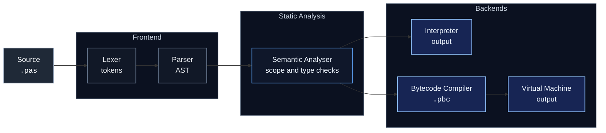

# Pascal Interpreter

A Pascal-like language project built from scratch in Python with zero external dependencies. It currently combines a shared frontend, a working tree-walking interpreter, a stack-based bytecode compiler, and a virtual machine that executes emitted `.pbc` files.

---

## Why This Project

I became fascinated with compilers and interpreters after learning C and ARM32 assembly. I created this project to unravel layers of abstraction that most of us take for granted and to learn how a piece of text turns into instructions that can be executed.

It is also meant to be a practical systems-style project rather than just a toy parser. The repository focuses on clear stage separation, explicit grammar rules, scoped symbol tables, type checking, and representative example programs so the implementation is easy to inspect, extend, and discuss.

---

## Features

| Category | Details |
|---|---|
| **Lexer** | Tokenises Pascal keywords, identifiers, numeric/string/boolean literals, operators, `{ }` block comments |
| **Parser** | Recursive-descent parser producing a full AST |
| **Semantic Analysis** | Symbol table with scoped lookups, type checking, duplicate/undeclared variable detection |
| **Interpreter** | Tree-walking evaluator with scoped variable storage |
| **Bytecode Compiler** | Stack-based bytecode emitter that writes textual `.pbc` files |
| **Virtual Machine** | Stack VM with labels, jumps, call frames, scoped variables, arithmetic, comparisons, and I/O |
| **Type System** | `INTEGER`, `REAL`, `BOOLEAN`, `STRING` with automatic widening (`INTEGER` -> `REAL`) |
| **Control Flow** | `IF/THEN/ELSE`, `WHILE/DO`, `FOR/TO/DOWNTO` |
| **Procedures & Functions** | Declaration, parameter passing, recursion, nested scopes |
| **I/O** | `WRITE` and `WRITELN` statements |
| **Strings** | String literals, concatenation (`+`), and equality comparison |
| **CLI Modes** | Run source files, compile source files to bytecode, or execute `.pbc` files through the VM |
| **Error Reporting** | Line and column numbers in all error messages (`LexerError`, `ParserError`, `SemanticError`, `InterpreterError`, `BytecodeError`) |

---

## Getting Started

### Prerequisites

- **Python 3.6+** (no external packages required)

### Run a Script

```bash
python src/main.py instructions/triangle.pas
```

### Run All Scripts in a Directory

```bash
python src/main.py instructions/
```

### Compile to Bytecode

```bash
python src/main.py
```

```text
script> :compile instructions/triangle.pas
Wrote bytecode to instructions/triangle.pbc
```

Compiled bytecode is written next to the source file using the `.pbc` extension.

### Run Bytecode in the VM

```bash
python src/main.py
```

```text
script> :vm instructions/triangle.pbc
```

### Interactive Mode

```bash
python src/main.py
```

```
========================
Alex's PascalInterpreter
========================

script> :run instructions/functions.pas
script> :compile instructions/triangle.pas
script> :vm instructions/triangle.pbc
script> instructions/triangle.pas
script> :help
script> :q
```

---


## Architecture

The project uses a shared frontend with two backends:



Each stage is cleanly separated into its own module:

| Stage | Module | Responsibility |
|---|---|---|
| **Lexical Analysis** | [`src/Lexer.py`](src/Lexer.py) | Converts source text into a stream of tokens |
| **Parsing** | [`src/Parser.py`](src/Parser.py) | Builds an Abstract Syntax Tree from tokens using recursive descent |
| **AST Nodes** | [`src/nodes.py`](src/nodes.py) | Defines all AST node classes (`Program`, `Block`, `BinaryOperation`, `If`, `While`, `For`, etc.) |
| **Semantic Analysis** | [`src/SemanticAnalyser.py`](src/SemanticAnalyser.py) | Populates symbol tables, enforces type rules, validates declarations |
| **Interpretation** | [`src/interpreter.py`](src/interpreter.py) | Tree-walking evaluator that executes the validated AST |
| **Bytecode Emission** | [`src/bytecode.py`](src/bytecode.py) | Emits stack-based textual bytecode |
| **Virtual Machine** | [`src/vm.py`](src/vm.py) | Executes `.pbc` bytecode with a stack, labels, jumps, and call frames |
| **Visitor Base** | [`src/visitor.py`](src/visitor.py) | Generic visitor pattern base class used by both the analyser and interpreter |
| **Tokens & Symbols** | [`src/tokens.py`](src/tokens.py) | Token definitions, symbol classes, symbol table, and custom exception types |
| **Entry Point** | [`src/main.py`](src/main.py) | CLI runner with interactive REPL, file/directory execution, and bytecode compilation |

Today that means:

- `:run <path>` executes Pascal source through the interpreter
- `:compile <path>` emits `.pbc` bytecode files alongside the source
- `:vm <path>` executes `.pbc` files through the VM

---

## Example Programs

### Pascal's Triangle

Recursion, functions, and nested loops:

**[`instructions/triangle.pas`](instructions/triangle.pas)**

```pascal
PROGRAM triangle;

VAR
    n, r, limit, spaces : INTEGER;

FUNCTION factorial(n : INTEGER) : INTEGER;
BEGIN
    IF n <= 1 THEN
        factorial := 1
    ELSE
        factorial := n * factorial(n - 1);
END;

FUNCTION choose(n, r : INTEGER) : INTEGER;
BEGIN
    choose := factorial(n) DIV (factorial(n - r) * factorial(r));
END;

BEGIN
    limit := 10;
    FOR n := 0 TO limit - 1 DO
    BEGIN
        FOR spaces := 0 TO limit - n - 1 DO
            WRITE(' ');
        FOR r := 0 TO n DO
        BEGIN
            WRITE(choose(n, r));
            WRITE(' ');
        END;
        WRITELN('');
    END;
END.
```

**Output:**

```
          1
         1 1
        1 2 1
       1 3 3 1
      1 4 6 4 1
     1 5 10 10 5 1
    1 6 15 20 15 6 1
   1 7 21 35 35 21 7 1
  1 8 28 56 70 56 28 8 1
 1 9 36 84 126 126 84 36 9 1
```

### Recursive Factorial

**[`instructions/functions.pas`](instructions/functions.pas)**

```pascal
PROGRAM recursion;
FUNCTION Factorial(n : INTEGER) : INTEGER;
BEGIN
    IF n = 1 THEN Factorial := 1
    ELSE Factorial := n * Factorial(n - 1);
END;

BEGIN
    WRITELN(Factorial(5));
END.
```

**Output:**

```
120
```

### Recursive Procedure

Countdown example:

**[`instructions/recursion.pas`](instructions/recursion.pas)**

```pascal
PROGRAM recursion;
PROCEDURE Recurse(depth : INTEGER);
BEGIN
    WRITELN(depth);
    IF depth > 0 THEN
        Recurse(depth - 1);
END;

BEGIN
    Recurse(5);
END.
```

**Output:**

```
5
4
3
2
1
0
```

### Recursive Procedure with String Concatenation

**[`instructions/string_recursion.pas`](instructions/string_recursion.pas)**

```pascal
PROGRAM string_recursion;
PROCEDURE Recurse(str : STRING; depth : INTEGER);
BEGIN
    WRITELN(str + 'a');
    IF depth > 0 THEN
        Recurse(str + 'a', depth - 1);
END;

BEGIN
    Recurse('', 5);
END.
```

**Output:**

```
a
aa
aaa
aaaa
aaaaa
aaaaaa
```

### Bytecode Showcase

The repo also includes a larger feature-coverage program and its current emitted bytecode:

- [`instructions/FeatureShowcase.pas`](instructions/FeatureShowcase.pas)
- [`instructions/FeatureShowcase.pbc`](instructions/FeatureShowcase.pbc)
- [`BYTECODE.md`](BYTECODE.md) for the bytecode language design
- [`PLAN.md`](PLAN.md) for the current compiler / VM roadmap

---

## Grammar

The language is defined by a formal BNF/EBNF grammar. See [`grammar.txt`](grammar.txt) for the full specification and [`GRAMMAR_GUIDE.md`](GRAMMAR_GUIDE.md) for a guide on reading the notation.

<details>
<summary><strong>Click to expand full grammar</strong></summary>

```
program             : PROGRAM variable SEMI block DOT

block               : declarations compound_statement

declarations        : (VAR (variable_declaration SEMI)+)?
                      (procedure_declaration | function_declaration)*

variable_declaration: ID (COMMA ID)* COLON type_spec

procedure_declaration: PROCEDURE ID (LPAREN parameter_list RPAREN)? SEMI block SEMI

function_declaration : FUNCTION ID (LPAREN parameter_list RPAREN)? COLON type_spec SEMI block SEMI

parameter_list      : parameters (SEMI parameters)*

parameters          : ID (COMMA ID)* COLON type_spec

type_spec           : INTEGER | REAL | BOOLEAN | STRING

compound_statement  : BEGIN statement_list END

statement_list      : statement (SEMI statement_list)?

statement           : compound_statement
                    | assignment_statement
                    | procedure_call_statement
                    | if_statement
                    | while_statement
                    | for_statement
                    | write_statement
                    | writeln_statement
                    | empty

assignment_statement: variable ASSIGN expression

procedure_call_statement: ID (LPAREN (expression (COMMA expression)*)? RPAREN)?

if_statement        : IF expression THEN statement (ELSE statement)?

while_statement     : WHILE expression DO statement

for_statement       : FOR variable ASSIGN expression (TO | DOWNTO) expression DO statement

write_statement     : WRITE LPAREN expression RPAREN

writeln_statement   : WRITELN LPAREN expression RPAREN

expression          : arithmetic_expr ((EQUAL | NOT_EQUAL | LESS_THAN
                    | LESS_EQUAL | GREATER_THAN | GREATER_EQUAL) arithmetic_expr)?

arithmetic_expr     : term ((PLUS | MINUS) term)*

term                : factor ((MUL | INTEGER_DIV | FLOAT_DIV) factor)*

factor              : PLUS factor
                    | MINUS factor
                    | INTEGER_CONST | REAL_CONST | BOOLEAN_CONST | STRING_CONST
                    | function_call
                    | LPAREN expression RPAREN
                    | variable

function_call       : ID LPAREN (expression (COMMA expression)*)? RPAREN

variable            : ID
```

</details>

---

## Semantic Rules

The semantic analyser enforces these rules **before** execution:

- **Declaration required** - variables must be declared before use
- **No duplicates** - duplicate variable, procedure, and function declarations are rejected
- **Boolean conditions** - `IF` and `WHILE` conditions must evaluate to `BOOLEAN`
- **FOR loops** - loop variable, start, and end expressions must be `INTEGER`
- **Integer division** - `DIV` requires both operands to be `INTEGER`
- **Float division** - `/` always yields `REAL`
- **Arithmetic promotion** - `+`, `-`, `*` yield `INTEGER` when both operands are `INTEGER`, otherwise `REAL`
- **Comparison operators** - yield `BOOLEAN`; operands must be numeric or both strings for `=` and `<>`
- **String operations** - `+` concatenates strings; `=` and `<>` compare strings
- **Assignment compatibility** - exact type match or widening `INTEGER` -> `REAL`
- **Procedure/function arity** - argument count must match parameter count
- **Argument types** - each argument must be assignment-compatible with its parameter

---

## Error Reporting

All errors include line and column numbers for easier debugging:

```
line 5, column 12: Variable X is not defined
line 8, column 1: Type Error: IF condition must evaluate to BOOLEAN
line 3, column 20: Expected SEMI, got DOT
```

Error types:

| Error Class | Source | Examples |
|---|---|---|
| `LexerError` | Lexical analysis | Invalid characters, unterminated strings/comments |
| `ParserError` | Parsing | Unexpected tokens, missing delimiters |
| `SemanticError` | Semantic analysis | Type mismatches, undeclared variables, duplicate declarations |
| `InterpreterError` | Runtime | Division by zero, undefined variables at runtime |
| `BytecodeError` | Bytecode / VM runtime | Unsupported bytecode, stack underflow, missing labels, missing variables, division by zero |

---

## Project Structure

```text
Interpreter/
|-- src/
|   |-- main.py               # CLI entry point and interactive REPL
|   |-- Lexer.py              # Lexical analyser (tokeniser)
|   |-- Parser.py             # Recursive-descent parser -> AST
|   |-- nodes.py              # AST node class definitions
|   |-- SemanticAnalyser.py   # Type checking and symbol table logic
|   |-- interpreter.py        # Tree-walking runtime evaluator
|   |-- bytecode.py           # Stack-based bytecode emitter (.pbc output)
|   |-- vm.py                 # Stack VM for executing emitted bytecode
|   |-- visitor.py            # Generic visitor pattern base
|   `-- tokens.py             # Token types, symbols, and exceptions
|-- instructions/
|   |-- FeatureShowcase.pas   # Large feature-coverage example program
|   |-- FeatureShowcase.pbc   # Emitted bytecode output for inspection
|   |-- triangle.pas          # Pascal's Triangle demo
|   |-- functions.pas         # Recursive factorial
|   |-- recursion.pas         # Recursive procedure
|   `-- string_recursion.pas  # String concatenation with recursion
|-- BYTECODE.md               # Bytecode language structure and instruction design
|-- PLAN.md                   # Ongoing compiler / VM implementation notes
|-- grammar.txt               # Formal language grammar (EBNF)
|-- GRAMMAR_GUIDE.md          # How to read the grammar notation
|-- syntax_guide.pas          # Full Pascal syntax reference
`-- README.md
```

---

## Roadmap

- [ ] Nested `BEGIN/END` scoping for local variables
- [ ] Arrays and record types
- [ ] `REPEAT/UNTIL` loops
- [ ] `CASE` statements
- [ ] `CONST` declarations
- [ ] Boolean operators (`AND`, `OR`, `NOT`)
- [ ] Multi-argument `WRITE`/`WRITELN`
- [ ] Interpreter-vs-VM output comparison test harness
- [ ] Optional ARM64 assembly backend
- [ ] Source-level debugger with stepping and breakpoints

---

## Licence

This project is licensed under the [MIT License](LICENSE).
